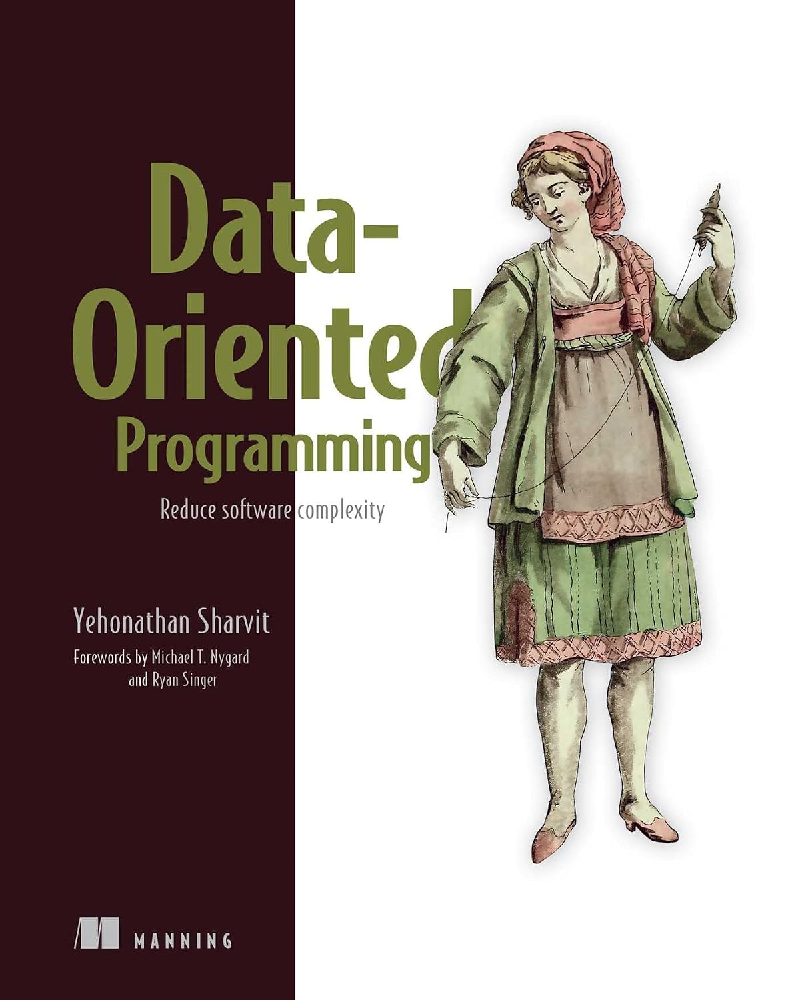
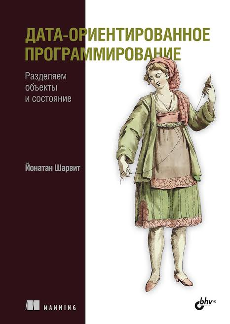

# DOP
Introspection based on review of book, for example: Data-Oriented Programming

| _eng_                                                                                                                                                     | _rus_                                                                                                       |
|-----------------------------------------------------------------------------------------------------------------------------------------------------------|-------------------------------------------------------------------------------------------------------------|
| **[Data-Oriented Programming: Reduce software complexity](https://www.amazon.com/Data-Oriented-Programming-Unlearning-Yehonathan-Sharvit/dp/1617298573)** | **[Дата-ориентированное программирование](https://bhv.ru/product/data-orientirovannoe-programmirovanie)**   |
| authored by [Yehonathan Sharvit](https://github.com/viebel) - Full-Stack Web Consultant. Expert in Clojure, ClojureScript and Javascript                  | автор Йонатан Шарвит                                                                                        |
| published at August 16, 2022                                                                                                                              | публикация 2024                                                                                             |
|                                                                                                                      |                                                                        |

---
### DOP realisation approaches
Дата-ориентированное программирование реализуется с помощью 
- записей (Records)
- сопоставления с образцом (Pattern Matching)
- неизменяемых коллекций (Immutable Collections)

Данные и функции разделены. Данные описываются как неизменяемые структуры, а логика выносится в отдельные статические функции или сервисы 

#### Описание данных (Records)
Для создания неизменяемых моделей данных используются позиционные записи - они автоматически реализуют сравнение по значению и запрещают изменение свойств после создания

```csharp
public record Customer(string Id, stirng Nam, decimal Balance, bool IsPremium);
public record Order(string Id, stirng CustomerId, decimal TotalAmout);
```

#### Изменение данных (With-выражение)
Так как данные неизменяемы, вместо модификации объекта создается его копия с новыми значениями с помощью ключевого слова `with`

```csharp
var customer = new Customer("1", "Алексей", 100m, false);

// создаем нового клиента на основе старого, измений только баланс
var updatedCustomer with { Balance = 150m };
```

#### Обработка данных (Pattern Matching)
Вся бизнес-логика выносится в чистые функции. Вместо полиморфизма (как в ООП) используется сопоставление с образцом (switch), которое проверяет структуру данных

```csharp
public static class DiscountService
{
    // чистая функция: зависит только от входных данных и не меняет их
    public static decimal CalculateDiscount(Customer customer, Order order) =>
    {
        // премиум клиент всегда получает 15%
        ( { IsPremium: true }, _ ) => 0.15m;
        
        // обычные клиент при купном ... 
        ...
    }
}
```
---
### The Apache Software Foundation (ASF) list of projects grouped by types
#### Databases & Storage
	- Cassandra: Highly scalable, distributed NoSQL database.
	- HBase: Bigtable-like distributed database for massive datasets.
	- CouchDB: Document-oriented NoSQL database utilizing JSON.
	- Accumulo: Sorted, distributed key/value store with robust security.
#### Big Data Analytics & Distributed Computing
	- Hadoop: Framework for distributed storage and processing of large datasets.
	- Spark: Unified analytics engine for large-scale data processing.
	- Flink: Framework for stateful computations over data streams.
	- Beam: Unified programming model for batch and streaming data pipelines.
#### Data Integration & Messaging
	- Kafka: Distributed event streaming platform.
	- NiFi: Automated and managed data flow system.
	- ActiveMQ: Flexible, multi-protocol message broker.
	- Pulsar: Cloud-native, distributed messaging and streaming platform.
#### Servers & Networking
	- HTTP Server: The cornerstone web server project.
	- Tomcat: Open-source implementation of Jakarta Servlet and Expression Language.
	- APISIX: Cloud-native microservices API gateway.
#### Workflow & Coordination
	- Airflow: Platform to programmatically author, schedule, and monitor workflows.
	- ZooKeeper: Centralized service for maintaining configuration information and distributed coordination.
#### Software Development & Build Tools
	- Maven: Comprehensive comprehension and build management tool.
	- Ant: Java-based build tool resembling Make.
#### Libraries & Formats
	- Arrow: Columnar in-memory analytics platform.
	- Avro: Data serialization system providing rich data structures.
